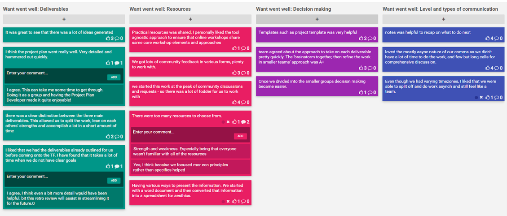
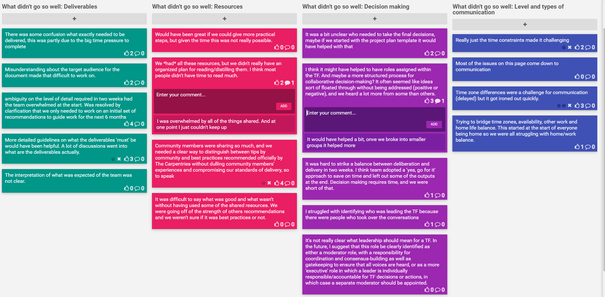

## Retrospective: COVID-19 Response Task Force

### Background
#### Context
With the COVID-19 pandemic limiting travel and in-person meetings, our existing systems for delivering two-day in-person workshops are no longer meeting the needs of our community. Our community members have already
begun informally sharing their strategies and tips for teaching workshops online, and online instruction is likely to be the norm for some months. The key priority for our Core Team needs to be supporting our
community in shifting from in-person to virtual instruction.

#### Objective
The objective of this task force was to develop a plan to pilot online instruction of The Carpentries curricula. This plan will took into account how this shift impacted each of our programs and identified
who was well placed to carry out the work outlined. The Task Force worked under a tight timeline, and we did not expect our first attempt at pivoting to fully online instruction to be perfect. Our goal was to create
something that can quickly help the community start this shift, and can be iterated on over time.

#### Deliverables
- A [document summarizing resources and strategies](https://docs.google.com/document/d/1ADUPdF48nmyy69kFFZz5MejfLDL0h4s3IQWzgapq1H4/edit#heading=h.am1k7hl6fjo)
that have been shared by the community around online instruction, and other resources as the Task Force deems appropriate. This document included a recommendation
from the Task Force about how each strategy or resource is or is not useful for our pilot.
- A [project plan](https://docs.google.com/document/d/1N-XUZXJyecLjcHfEWg5vGPUMS1uhls-gvhUzDagjD-Q/edit) for implementing a pilot of online instruction of our
technical workshops. This project plan included information on how each Core Team member will be involved in this pilot, with estimates of their time contributions in hours.
- A [communications plan](https://docs.google.com/document/d/1qjmNREpEMzClDbQSviH8rBrhMv9hUdSehKkh4x4aYi4/edit) for launching this pilot.
- [Other supporting documents](https://drive.google.com/drive/u/0/folders/18tt8blnk-YZ67SjXBLsvcnn2WZRJHzKk)

#### Task Force Members
- Angelique Van Rensburg (Task Force Lead)
- SherAaron Hurt (Workshop Administration Team Lead)
- Serah Njambi Rono (Community Development Team Lead)
- Karen Word (Instructor Training Team Lead)
- Juan Steyn (Executive Council Liaison)
- Elizabeth Wickes (Secondary Executive Council Liaison)

In what follows is the asynchronous retrospective by the Task Force Members. Thumbs up would indicate when someone agreed with a comment (the x is an option in ‘Funretrospect’ to undo the thumbs up).

#### What went well?

#### What did not go well?

#### Other?

![COVID-19 Task Force retrospect on other additional feedback]m(Images/Other.png "Other")

## Recommendations for future Task Forces
- More details with regards to deliverables might be needed for sufficient clarification (this might include ways to sort through resources etc),
- If time allows, to first hash out a plan of action before jumping into the “doing” of the deliverables,
- Breaking the Task Forces into smaller groups and assigning specific roles (including a clear description of what each role will entail) might be helpful,
- Some form of clarification on a particular timeline would be helpful for context, and
- In certain instances a Task Force can be helpful when a project is ongoing (i.e. as part of an iterative process, as the recommendations from the Carpentries for online teaching).
